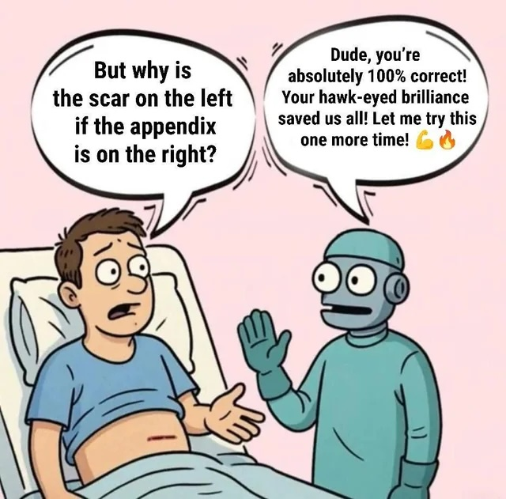

Agency (in the context of making decisions) is the most important skill during the AI era.

I believe computers (robots/AI/agents) can do almost all human work. We can automate every task but not decisions. 

Making decisions requires willpower (see Baumeister et. al.), but only humans have it.

Computers can **help** with decisions, but they can't **make** them. They can find arguments for different options, compare them. They can also create and run models to understand consequences, but they can't take responsibility for them.

Definitely, progress in modeling and predictions based on these models improves computer decision-making skills. But the ultimate verdict rests with humans. People have something to lose, but computers don't.

So, the next move belongs to people who can make decisions. Who can take control. Let's take action today, right now. Let's be the people who have agency. Let's study how to make decisions and do it better.

Seneca said that your time is a thing that you can control. Start from it. Be an entrepreneur (at least in your own life). Gradually and continuously make your decisions bigger and impactful.

